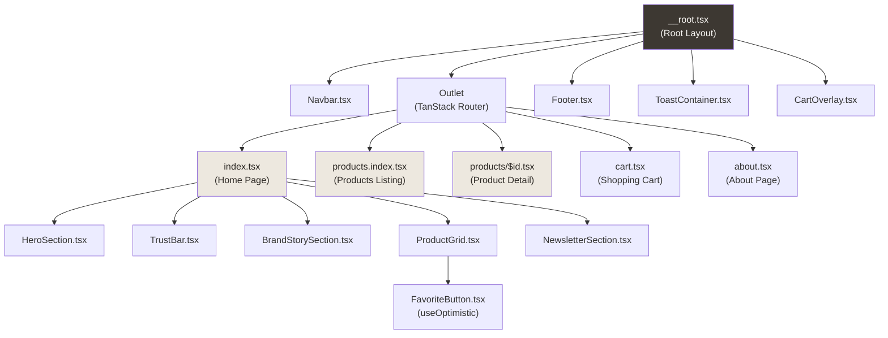
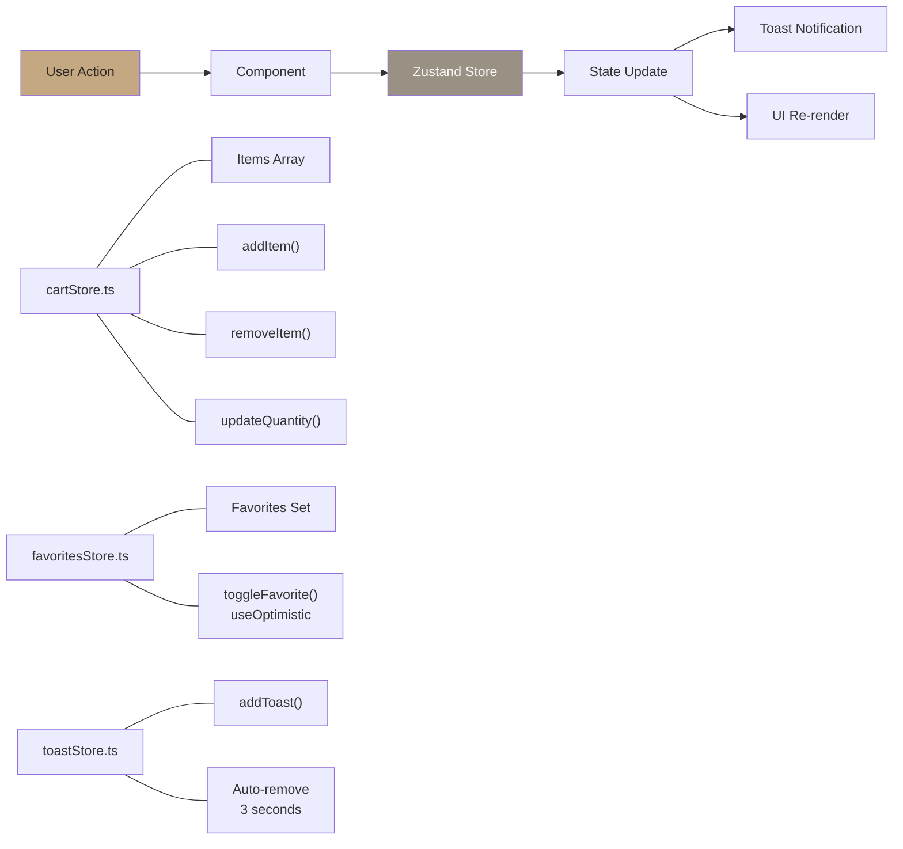
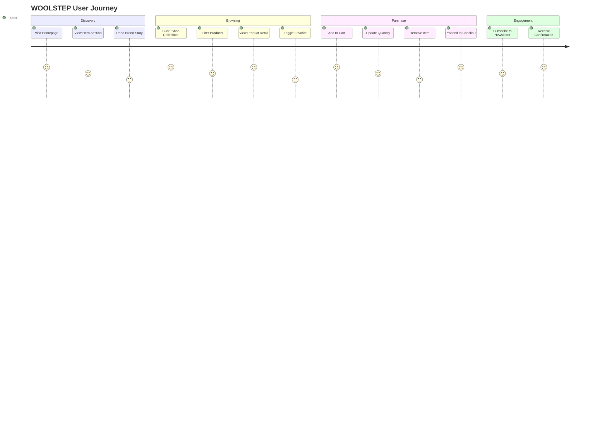

# 🧶 WOOLSTEP MVP#

<p align="center">
  <strong>Natural Comfort. Urban Function.</strong>
</p>

<p align="center">
  <a href="https://github.com/yourusername/woolstep-mvp/actions"></a>
  <a href="https://github.com/yourusername/woolstep-mvp/blob/main/LICENSE"></a>
  <a href="https://react.dev"></a>
  <a href="https://www.typescriptlang.org"></a>
  <a href="https://vitejs.dev"></a>
  
</p>

<p align="center">
  <a href="#getting-started"><strong>Get Started</strong></a> ·
  <a href="#deployment"><strong>Deploy</strong></a> ·
  <a href="#react-19-features"><strong>React 19 Features</strong></a>
</p>

---

## 📖 Introduction#

**WOOLSTEP** is a premium wool sneaker e-commerce MVP designed for Singapore's urban tropical lifestyle. This project showcases the perfect marriage of **merino wool comfort** and **modern React 19 capabilities**, serving as a functional prototype for a full-scale e-commerce platform.

### ✨ Key Features#

- 🧶 **Merino Wool Technology** — Natural, breathable, temperature-regulating
- 🌴 **Singapore-Optimized** — Designed for tropical humidity
- 🎨 **Anti-Generic Design** — "Wool & Fog" palette, brutalist-minimal aesthetic
- ⚡ **React 19 Features** — `useActionState`, `useOptimistic` hooks
- 🚀 **Lightning Fast** — Vite 8 with Rolldown (10-30x faster builds)
- 📱 **Fully Responsive** — Mobile-first with dedicated mobile navigation
- 🛒 **Smart Cart** — Zustand state with persistence + toast notifications
- 🧪 **Thoroughly Tested** — 9 Vitest tests covering stores and components#

### 🎨 Design Philosophy#

> **Anti-Generic Approach**: We reject Bootstrap-style grids, Inter/Roboto safe choices, and the homogenized "AI slop" aesthetic. Every element is intentional — from the "Wool & Fog" color palette to the editorial typography pairing of Playfair Display and DM Sans.

---

## 🛠 Tech Stack#

| Category | Technology | Version | Purpose |
|----------|--------------|---------|---------|
| **Frontend** | React | 19.0.6 | UI library with latest concurrent features |
| **Language** | TypeScript | 5.9.3 | Type-safe development with `erasableSyntaxOnly` |
| **Build Tool** | Vite | 8.0.11 | Next-gen bundler with Rolldown Rust engine |
| **Styling** | Tailwind CSS | v4 | CSS-first utility framework with `@theme` |
| **Routing** | TanStack Router | 1.114 | File-based routing with type safety |
| **State** | Zustand | 5.0 | Lightweight state management with persistence |
| **UI** | shadcn/ui | Latest | Accessible component primitives |
| **Icons** | Lucide React | 0.460 | Beautiful, consistent icon set |
| **Testing** | Vitest | 3.2 | Unit and integration testing |
| **E2E** | Testing Library | 16.3 | React component testing utilities |

---

## 🏗 Architecture#

### Component Hierarchy#



### State Management Flow#



---

## 📁 File Structure#

```
woolstep-mvp/
├── 📄 index.html                          # Entry HTML with Google Fonts
├── 📄 package.json                        # Dependencies (React 19, Vite 8, TS 5.9)
├── ⚙️ vite.config.ts                     # Vite config with TanStack + Tailwind plugins
├── ⚙️ tsconfig.json                      # TypeScript strict + erasableSyntaxOnly
├── ⚙️ vitest.config.ts                   # Test configuration with jsdom
├── 🎨 src/globals.css                     # Tailwind v4 with @theme (Wool & Fog palette)
├── 🚀 src/main.tsx                       # React 19 entry with ErrorBoundary
│
├── 📂 src/components/
│   ├── 📂 ui/                            # shadcn/ui primitives
│   │   ├── 🧩 button.tsx                    # Button with CVA variants
│   │   ├── 🃏 card.tsx                      # Card, CardHeader, CardContent
│   │   ├── ⌨️ input.tsx                    # Form input component
│   │   └── 🏷️ badge.tsx                    # New/Sale badges
│   │
│   ├── 📂 layout/                        # Layout components
│   │   ├── 🧭 Navbar.tsx                  # Fixed nav with scroll detection
│   │   └── 👇 Footer.tsx                  # Site footer with newsletter + payment icons
│   │
│   ├── 📂 sections/                      # Page sections
│   │   ├── 🎬 HeroSection.tsx             # Landing page hero with accent
│   │   ├── 🛡 TrustBar.tsx                 # Trust indicators (NEW)
│   │   ├── 📖 BrandStorySection.tsx       # 4 features + expanded narrative
│   │   ├── 🛍️ ProductGrid.tsx            # Filterable product grid + sizes
│   │   └── 📧 NewsletterSection.tsx       # useActionState demo
│   │
│   ├── 🚨 ErrorBoundary.tsx                # Class-based error boundary
│   ├── 🔔 ToastContainer.tsx              # Toast notifications
│   └── 📂 cart/                         # Cart components
│       ├── 🛒 CartPanel.tsx              # Cart items + total
│       ├── 🛍️ CartItem.tsx              # Individual cart item
│       ├── 🔴 CartOverlay.tsx             # NEW: Semi-transparent overlay
│       └── ❤️ FavoriteButton.tsx          # useOptimistic demo
│
├── 📂 src/stores/                       # Zustand stores
│   ├── 🛒 cartStore.ts                  # Cart state + persistence
│   ├── 🛍️ productStore.ts              # Product data + filtering
│   ├── ❤️ favoritesStore.ts            # Favorites with useOptimistic
│   └── 🔔 toastStore.ts                 # Toast notifications
│
├── 📂 src/routes/                       # TanStack Router (file-based)
│   ├── 📄 __root.tsx                    # Root layout + CartOverlay
│   ├── 📄 index.tsx                    # Home page (/)
│   ├── 📄 about.tsx                    # About page (/about)
│   ├── 📄 cart.tsx                     # Cart page (/cart)
│   ├── 📄 products.index.tsx           # Products (/products)
│   └── 📂 products/
│       └── 📄 $id.tsx                  # Product detail (/products/:id)
│
├── 📂 src/types/                        # TypeScript definitions
│   └── 📄 index.ts                     # Product, CartItem, Filter types
│
├── 📂 src/lib/                          # Utilities
│   └── 📄 utils.ts                     # cn() helper (clsx + tailwind-merge)
│
├── 📂 src/test/                         # Vitest tests
│   ├── 📄 setup.ts                     # Test setup (jest-dom)
│   ├── 🧪 cartStore.test.ts            # 3 passing tests
│   ├── 🧪 favoritesStore.test.ts      # 3 passing tests
│   └── 🧪 toastStore.test.ts          # 3 passing tests
│
└── 📂 .github/workflows/
    └── 🚀 ci.yml                          # CI/CD (test, build, deploy)
```

---

## 🗺️ User Journey#



---

## ⚙️ Application Logic Flow#

### React 19 Hooks in Action#

```mermaid
flowchart TD;
    subgraph "Newsletter Section (useActionState)"
        A1[User Enters Email] --> B1[formAction Called]
        B1 --> C1[Show Pending State<br/>Subscribing...]
        C1 --> D1[API Call<br/>Simulated 1s]
        D1 --> E1{Valid Email?}
        E1 -->|Yes| F1[Show Success Toast]
        E1 -->|No| G1[Show Error Toast]
    end;
    
    subgraph "Favorites (useOptimistic)"
        A2[User Clicks Heart] --> B2[addOptimisticFavorite]
        B2 --> C2[Instant UI Update<br/>❤️ / 🤍]
        C2 --> D2[API Call toggleFavorite]
        D2 --> E2{Success?}
        E2 -->|Yes| F2[Confirm State]
        E2 -->|No| G2[Rollback UI]
    end;
    
    subgraph "Cart (Zustand)"
        A3[Click "Quick Add"] --> B3[addItem()]
        B3 --> C3[Update items Array]
        C3 --> D3[Show Success Toast]
        C3 --> E3[Persist to localStorage]
    end;
    
    style A1 fill:#C4A882,color:#2C2824;
    style A2 fill:#C4A882,color:#2C2824;
    style A3 fill:#C4A882,color:#2C2824;
```

---

## 🚀 Getting Started#

### Prerequisites#

- **Node.js**: v24.12.0 or higher
- **npm**: v11.13.0 or higher
- **Vite**: v8.0.11 (installed locally)

### Installation#

```bash
# Clone the repository
git clone https://github.com/yourusername/woolstep-mvp.git
cd woolstep-mvp

# Install dependencies (use --legacy-peer-deps for Vite 8 compatibility)
npm install --legacy-peer-deps
```

### Development#

```bash
# Start Vite dev server (http://localhost:5173)
npm run dev

# Generate TanStack Router route tree (after route changes)
npx tsr generate
```

### Production Build#

```bash
# TypeScript check + Vite build
npm run build

# Preview production build locally
npm run preview
```

---

## 📜 Available Scripts#

| Command | Description |
|---------|-------------|
| `npm run dev` | Start development server with HMR (port 5173) |
| `npm run build` | TypeScript check + production build to `dist/` |
| `npm run preview` | Preview production build locally |
| `npm test` | Run Vitest tests (watch mode) |
| `npx vitest run` | Run tests once (CI mode) |
| `npx tsc --noEmit` | TypeScript type checking |
| `npx tsr generate` | Generate TanStack Router route tree |

---

## ⚡ React 19 Features#

### 1. `useActionState` — Newsletter Form#

Located in `src/components/sections/NewsletterSection.tsx`:

```tsx
const [state, formAction, isPending] = useActionState(
  async (prevState, formData) => {
    const email = formData.get('email') as string
    // Simulate API call
    await new Promise(resolve => setTimeout(resolve, 1000))
    return { message: 'Thanks for subscribing!', type: 'success' }
  },
  initialState
)

// Form uses action prop (React 19 feature)
<form action={formAction}>
  <input name="email" />
  <button disabled={isPending}>
    {isPending ? 'Subscribing...' : 'Subscribe'}
  </button>
</form>
```

### 2. `useOptimistic` — Favorites Toggle#

Located in `src/components/FavoriteButton.tsx`:

```tsx
const [optimisticFavorited, addOptimisticFavorite] = useOptimistic(
  favorites.has(productId),
  (state, _value) => !state  // Instant UI flip
)

const handleClick = async () => {
  addOptimisticFavorite(null)  // Update UI immediately
  await toggleFavorite(productId)  // Actual API call
}
```

### 3. React Compiler (Auto-Memoization)#

Enabled via Babel plugin in `vite.config.ts` — automatically optimizes re-renders without manual `useMemo`/`useCallback`.

---

## 🧪 Testing#

### Test Framework: Vitest 3.2+#

```bash
# Run all tests
npm test

# Run tests once (CI mode)
npx vitest run

# Run with UI
npx vitest --ui

# Run with coverage
npx vitest run --coverage
```

### Test Coverage#

| Test File | Tests | Status |
|-----------|-------|--------|
| `src/test/cartStore.test.ts` | 3 tests | ✅ Passing |
| `src/test/toastStore.test.ts` | 3 tests | ✅ Passing |
| `src/test/favoritesStore.test.ts` | 3 tests | ✅ Passing |
| **Total** | **9 tests** | **✅ All Passing** |

### Test Standards#

- **Behavior-driven**: Test what the user sees/does, not implementation
- **Testing Library**: `@testing-library/react` for component tests
- **Vitest API**: Use `describe/it/expect` from `vitest`
- **Factory pattern**: Generate test data with helper functions#

---

## 🚀 Deployment#

### Option 1: GitHub Pages (Recommended)#

The project includes a CI/CD workflow in `.github/workflows/ci.yml`:

```yaml
# Automatic deployment on push to main
1. Run tests (vitest)
2. Build project (tsc + vite build)
3. Deploy to GitHub Pages
```

**Setup Steps:**

1. Push code to GitHub repository
2. Go to **Settings → Pages**
3. Select **GitHub Actions** as source
4. Push to `main` branch — deployment happens automatically!

### Option 2: Vercel#

```bash
# Install Vercel CLI
npm i -g vercel

# Deploy
vercel --prod
```

**Configuration** (`vercel.json`):
```json
{
  "buildCommand": "npm run build",
  "outputDirectory": "dist",
  "devCommand": "npm run dev"
}
```

### Option 3: Netlify#

**Build Settings:**
- **Build command**: `npm run build`
- **Publish directory**: `dist`
- **Node version**: `24`

**Environment variables:**
```
NODE_VERSION=24
NPM_FLAGS=--legacy-peer-deps
```

---

## 🎨 Design System#

### "Wool & Fog" Color Palette#

```css
/* From src/globals.css */
--color-warm-white: #FAF8F5;    /* Backgrounds */
--color-oat: #EDE8DF;          /* Secondary background */
--color-foggy-gray: #D5CFC4;     /* Borders */
--color-stone: #9A9185;          /* Muted text */
--color-taupe: #7A7268;          /* Hover states */
--color-warm-charcoal: #3D3832;   /* Primary text/buttons */
--color-terracotta: #C4A882;      /* Accents */
--color-success: #8B9A7B;         /* Success states */
--color-error: #B87A6E;           /* Error states */
```

### Typography#

```css
--font-display: 'Playfair Display', Georgia, serif;  /* Headings */
--font-body: 'DM Sans', system-ui, sans-serif;     /* Body text */
```

---

## 🌿 Environment Variables (Future API Integration)#

| Variable | Purpose | Example |
|----------|---------|---------|
| `VITE_API_URL` | Backend API base URL | `https://api.woolstep.sg` |
| `VITE_GA_ID` | Google Analytics ID | `G-XXXXXXXXXX` |
| `VITE_STRIPE_KEY` | Stripe publishable key | `pk_live_...` |

---

## 🤝 Contributing#

We welcome contributions! Please follow these guidelines:

### Development Workflow#

1. **Fork** the repository
2. **Create** a feature branch (`git checkout -b feature/amazing-feature`)
3. **Commit** your changes (`git commit -m 'feat: add amazing feature'`)
4. **Push** to the branch (`git push origin feature/amazing-feature`)
5. **Open** a Pull Request#

### Commit Convention#

Follow **Conventional Commits**:
- `feat:` — New features
- `fix:` — Bug fixes
- `chore:` — Maintenance tasks
- `docs:` — Documentation updates
- `test:` — Test additions/changes#

### Code Standards#

- ✅ TypeScript strict mode (no `any`)
- ✅ `erasableSyntaxOnly` (no enums/namespaces)
- ✅ Use shadcn/ui components (don't build custom)
- ✅ Test behavior, not implementation
- ✅ Follow the Meticulous Approach (6-phase workflow)

---

## 📄 License#

Distributed under the MIT License. See `LICENSE` for more information.

---

## 🙏 Acknowledgments#

- **Design Inspiration**: WOOLSTEP (Singapore-based wool sneaker brand)
- **Typography**: Playfair Display & DM Sans (Google Fonts)
- **Icons**: Lucide React
- **Images**: Unsplash (merino wool sneaker photography)

---

<p align="center">
  <strong>Built with ❤️ using React 19 + TypeScript 5.9 + Vite 8</strong>
  <br />
  <em>Natural Comfort. Urban Function.</em>
</p>
